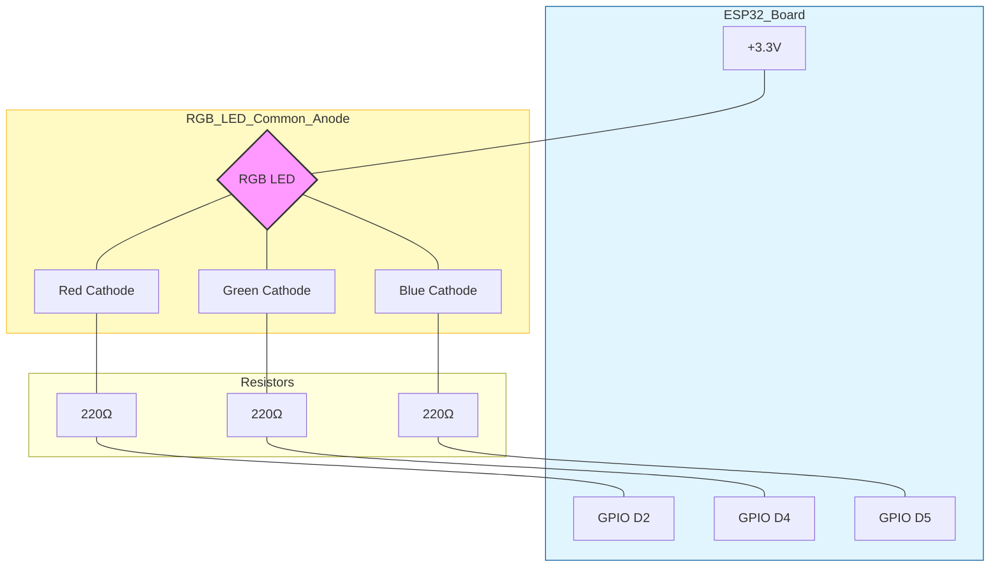

# ESP32 RGB LED Circuit Diagram

This diagram uses **Mermaid.js** syntax. You can view it directly in VS Code (with Markdown Preview), GitHub, or by pasting it into the [Mermaid Live Editor](https://mermaid.live/).

## Schematic

## Wiring Guide

| LED Pin | Component | ESP32 Pin |
| :--- | :--- | :--- |
| **Common Anode** (Longest Pin) | Direct Connection | **3.3V** |
| **Red Cathode** | 220Ω Resistor | **D2 (GPIO 2)** |
| **Green Cathode** | 220Ω Resistor | **D4 (GPIO 4)** |
| **Blue Cathode** | 220Ω Resistor | **D5 (GPIO 5)** |
